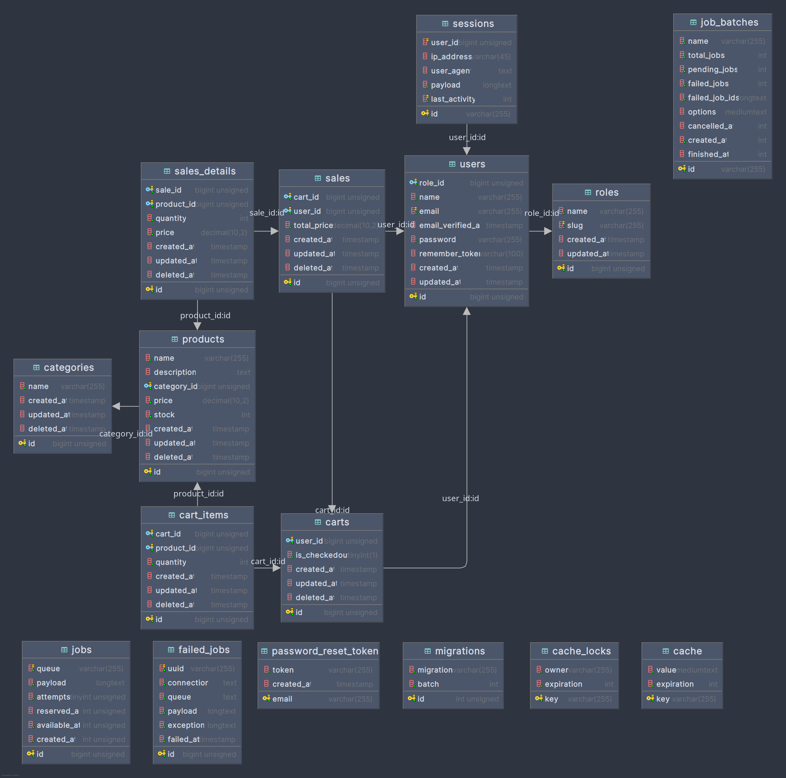

# Cafe Management System

<p align="center">
  
</p>

<p align="center">
  <a href="#features">Özellikler</a> •
  <a href="#installation">Kurulum</a> •
  <a href="#usage">Kullanım</a> •
  <a href="#screenshots">Ekran Görüntüleri</a> •
  <a href="#tech-stack">Teknoloji</a> •
  <a href="#contributors">Katkıda Bulunanlar</a> •
  <a href="#license">Lisans</a>
</p>

## Hakkında

Cafe Management System, cafe ve restoranların günlük operasyonlarını kolayca yönetmek için tasarlanmış kapsamlı bir yönetim yazılımıdır. Bu sistem ile sipariş takibi, stok yönetimi, satış raporlaması gibi tüm temel ihtiyaçlar kolayca karşılanabilir.

## Özellikler

- **Kullanıcı Yönetimi**
  - Rol tabanlı erişim kontrolü
  - Güvenli kimlik doğrulama
  - Kullanıcı izinleri ve yetkilendirme
  
- **Ürün ve Kategori Yönetimi**
  - Kategorilere göre ürün sınıflandırma
  - Ürün stok takibi
  - Hızlı ürün arama ve filtreleme
  
- **Satış Sistemi**
  - Sezgisel sepet arayüzü
  - Hızlı sipariş işleme
  - İade ve iptal yönetimi
  
- **Stok Yönetimi**
  - Otomatik stok düşme
  - Kritik stok seviyesi bildirimleri
  - Stok hareketi raporlaması
  
- **Raporlama**
  - Günlük, haftalık ve aylık satış raporları
  - En çok satan ürünler analizi
  - Excel'e veri aktarımı

- **Dashboard**
  - Satış analizleri ve grafikler
  - Kritik stok uyarıları
  - Hızlı erişim kartları

## Kurulum

### Sistem Gereksinimleri

- PHP >= 8.1
- MySQL veya MariaDB
- Composer
- Node.js ve NPM

### Adımlar

1. Projeyi klonlayın:
   ```bash
   git clone https://github.com/yourusername/cafe-management.git
   cd cafe-management
   ```

2. Bağımlılıkları yükleyin:
   ```bash
   composer install
   npm install
   ```

3. Ortam değişkenlerini ayarlayın:
   ```bash
   cp .env.example .env
   php artisan key:generate
   ```

4. .env dosyasında veritabanı ayarlarını yapılandırın:
   ```
   DB_CONNECTION=mysql
   DB_HOST=127.0.0.1
   DB_PORT=3306
   DB_DATABASE=cafe_management
   DB_USERNAME=root
   DB_PASSWORD=
   ```

5. Veritabanını oluşturun:
   ```bash
   php artisan migrate --seed
   ```

6. Varlıkları derleyin:
   ```bash
   npm run dev # veya npm run build
   ```

7. Uygulamayı çalıştırın:
   ```bash
   php artisan serve
   ```

8. Tarayıcınızda `http://localhost:8000` adresine gidin.

## Kullanım

### Varsayılan Yönetici Girişi

- **Email:** admin@example.com
- **Şifre:** password

### Hızlı Başlangıç

1. Sisteme giriş yapın
2. Önce kategoriler ve ürünler ekleyin
3. Stok bilgilerini güncelleyin
4. Satış ekranından sipariş oluşturabilirsiniz
5. Dashboard'dan raporları ve istatistikleri takip edin

## Ekran Görüntüleri

### Dashboard


### Ürünler


### Satış Ekranı


## Teknoloji

- **Backend:** Laravel 10
- **Frontend:** Blade, jQuery, Bootstrap
- **UI Framework:** AdminLTE 3
- **Grafik:** Chart.js
- **Tablolar:** DataTables
- **Raporlama:** Laravel Excel

## Katkıda Bulunanlar

- [Katkıda Bulunan Adı](https://github.com/username)

## Lisans

Bu proje [MIT lisansı](LICENSE) altında lisanslanmıştır.

```
© 2025 Cafe Management System
